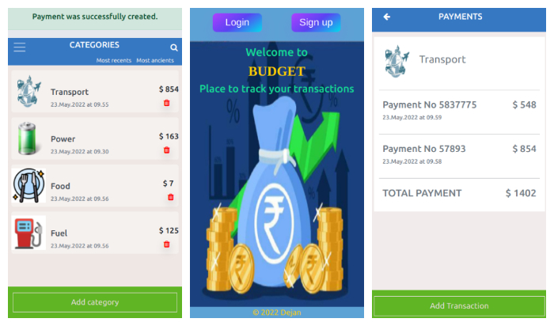

# Budget App
 
## Live preview
  ## Heroku [link](https://dejan-vu-budget.herokuapp.com/)

##  Video

#### Quick review of project and  code.
#### [video link](https://www.loom.com/share/165ba8f007f94a689d63ba05b33de8dc)

## App screenshot
 

## General info
 A simple mobile web application developed in Ruby on Rails to where you can manage your budget You have a list of payments associated with a category, so that you can see how much money you spent and on what.

 ## Contents
* [Splash-screen](#splashscreen)  
* [Categories](#categories)
* [Payments](#payments)

## Technologies
 Project is created with:
  * Ruby
  * Ruby on Rails
  * PostgresSQL
  * CSS

## Setup
To run this project, install it locally using:
- cd Desktop
- git clone https://github.com/VuDej/budget-app-rails.git
- cd Blog
- bundle install
- rails server
- in your browser open url : https://localhost:3000 to view the app.

## Author

👤 **Dejan Vujovic**

- Github : [@VuDej](https://github.com/VuDej)
- Twitter: [@DejanVuj](https://twitter.com/DejanVuj)
- LinkedIn : [@Dejan-Vujovic](https://www.linkedin.com/in/dejan-vujovic-5a0672225/)

## 🤝 Contributing

Contributions, issues, and feature requests are welcome!

Feel free to check the [issues page](https://github.com/VuDej/School-Library-Ruby/issues/1).

## Show your support

Give a ⭐️ if you like this project!

## 📝 License

This project is [MIT](LICENSE) licensed.

## Contact
Created by [@VuDej](https://github.com/VuDej)
